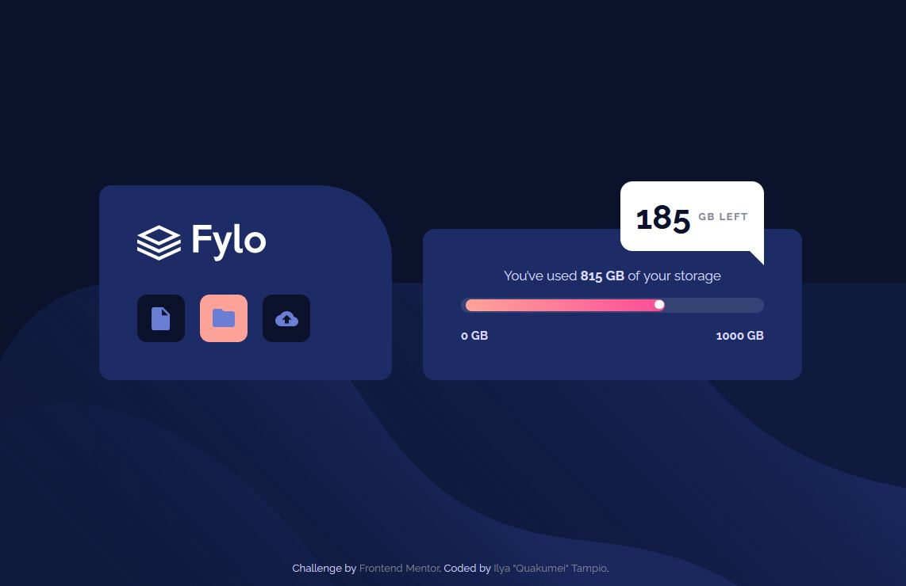

# Frontend Mentor - Fylo data storage component solution

This is a solution to the [Fylo data storage component challenge on Frontend Mentor](https://www.frontendmentor.io/challenges/fylo-data-storage-component-1dZPRbV5n). Frontend Mentor challenges help you improve your coding skills by building realistic projects. 

## Table of contents

- [Overview](#overview)
  - [The challenge](#the-challenge)
  - [Screenshot](#screenshot)
  - [Links](#links)
- [My process](#my-process)
  - [Built with](#built-with)
  - [What I learned](#what-i-learned)
  - [Continued development](#continued-development)
  - [Useful resources](#useful-resources)
- [Author](#author)

**Note: Delete this note and update the table of contents based on what sections you keep.**

## Overview

### The challenge

Users should be able to:

- View the optimal layout for the site depending on their device's screen size
- Additional (from me) make buttons beautiful!

### Screenshot




### Links

- Solution URL: [Github URL](https://github.com/Quakumei/FM-fylo-data-storage-component)
- Live Site URL: [Live site URL](https://fm-fylo-data-storage-component-quakumei.vercel.app/)

## My process

### Built with

- Semantic HTML5 markup
- CSS custom properties
- Flexbox
- CSS Grid
- Mobile-first workflow
- Animations!~~

### What I learned

1) Absolute positioning within elements
All I had to do is just write `position: relative` to the parent! I've needed too much time to realize that.
2) Way to make progress bars (a bit)
3) Animations! Yay!
```css
.circle {
    animation: load-circle 2s normal;
    ...
  }
  
@keyframes load-circle {
    0% { opacity: 0%; }
    100% { opacity: 100%;}
}   
```


### Continued development

There's one thing left unsolved.
If background is specified as in here
```css
background: linear-gradient(...);
```
or some image, i don't quite get how do I do a smooth transition on hover.
All methods seem lame, and maybe its me who is dumb, but, whatever. For now I had enough.

### Useful resources

- [28 CSS Progress Bars](https://freefrontend.com/css-progress-bars/) - No comments.


## Author

- Frontend Mentor - [@Quakumei](https://www.frontendmentor.io/profile/Quakumei)
- Github - [@Quakumei](https://github.com/Quakumei)


